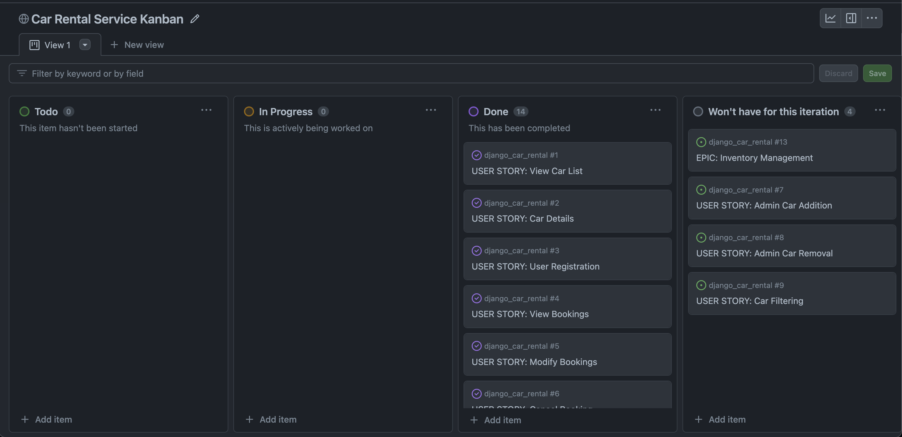
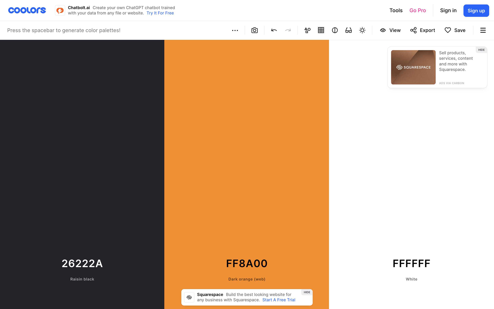

# SwiftGo Car Rental Service

SwiftGo Car Rental Service opens the door to automotive adventures. Our platform makes car rentals easy, offering reliability, convenience, and a diverse selection of vehicles. Whether you're planning a quick city drive or an extended road trip, SwiftGo has you covered. Book your car online effortlessly and hit the road with confidence, knowing you have a reliable vehicle for your journey. Join us today and embark on your next exciting car adventure with SwiftGo.

[View SwiftGo Car Rental service now](https://gg-car-rental-50d3bfa38b5d.herokuapp.com/)
- - -

## Table of Contents

### [User Experience](#user-experience-ux)
* [Project Goals](#project-goals)
* [Agile Methodology](#agile-methodology)
* [Target Audience](#target-audience)
* [First time user](#first-time-user)
* [Registered user](#registered-user)
* [Admin user](#admin-user)
### [Design](#design)
* [Color Scheme](#color-scheme)
* [Images](#images)
* [Wireframes](#wireframes)
* [Data Model](#data-models)
* [User Journey](#user-journey)
* [Database Scheme](#database-scheme)
### [Security Features](#security-features)
### [Features](#features)
### [Technologies Used](#technologies-used)
* [Languages Used](#languages-used)
* [Databases Used](#databases-used)
* [Frameworks Used](#frameworks-used)
* [Programs Used](#programs-used)
### [Deployment and Local development](#deployment-and-local-development)
* [Local Development](#local-development)
* [ElephantSQL Database](#elephantsql-database)
* [Cloudinary](#cloudinary)
* [Heroku Deployment](#heroku-deployment)
### [Testing](#testing)
### [References](#references)
* [Docs](#docs)
* [Content](#content)
* [Acknowledgments](#acknowledgments)

---

## User Experience (UX)

SwiftGo's user experience is carefully crafted to cater to users' diverse needs, providing a convenient and efficient online car rental service. From the moment users land on the homepage to the final steps of booking a car, the process is streamlined for ease and satisfaction.

### Project Goals

The SwiftGo project was conceptualized to enrich the portfolio with a comprehensive full-stack application built using Django. The key objective was to simulate a real-world car rental service, complete with user authentication, vehicle selection, and booking management. This platform demonstrates a blend of functionality and design, aiming to streamline the rental process with an emphasis on user convenience.

### Agile Methodology

As a nascent full-stack developer, the foray into Django was met with uncharted challenges and learning opportunities. Initial user stories were drafted to encapsulate fundamental features, setting the stage for the first iteration of development. This iterative process allowed for the prioritization of core functionalities, with additional features earmarked for future updates in the project's backlog.
Agile Methodology was used to help prioritize and organize tasks, writing the user stories and using Project Boards on Github. Template was created to help write User Stories and define Epics

* Epics were written containing possible user stories and based on that the website was made.
* User stories were created by looking at epics and through iterations the project was advancing.
* Project Board is set to public.
* Project Board was used to track progression of the task through the Todo, In progress and Done columns
* Labels were added to sort the issues based on the importance.

 User Stories Template

 Epic Template

 User Stories, Issues

 Project Board

### User Stories

#### Epics
* User Registration
* User Experience and Engagement
* Booking System Enhancement
* Maintain consistent design with responsiveness in mind

#### User Stories
1. Account Security and Management
* User registration, log in, log out
* Forgot password
* Email Confirmation

2. User Experience and Engagement and Booking System Enhancement
* Alert messages
* Crud functionality
* Car pagination
* Admin panel
* Double bookings
* Book Car
* Total Price

Detailed look can be found in the [project board](https://github.com/users/GenaPlem/projects/3)

### Target Audience

SwiftGo serves a broad demographic, welcoming anyone over the age of 20 with a minimum of two years of driving experience. Insurance options are tailored to different age groups, ensuring inclusivity and catering to varied user needs. The service is particularly advantageous for individuals who do not own a car or require a vehicle sporadically.

### First time user

New users are greeted by the homepage's hero section, which presents a picturesque background, an inviting title, and a slogan that encapsulates SwiftGo's ethos: "Explore in Style - Your journey, your terms." A call-to-action button, "Rent Now," beckons users to the cars listing page where they can embark on their rental journey.

On selecting a vehicle, first-time users are directed to the Car Reservation page where details of the chosen car are displayed. A prompt encourages unregistered users to sign in, guiding them seamlessly to the sign-in page. The header, consistently present across all pages, provides quick navigation to the sign-in page.

### Registered User

Once registered, users can fully engage with SwiftGo's services. The sign-up process is fortified with email confirmation to ensure security and authenticity. Upon successful registration and email verification, users gain the ability to book vehicles. The booking form, presented after the user has signed in, requests essential details and preferences, respecting the user's time and choices.

Should users wish to modify their upcoming bookings, the profile page provides a comprehensive view of their reservations, along with options to edit or cancel them. The booking process is safeguarded by validations in the datepicker, ensuring no overlaps with existing bookings and adherence to the rental rules.

### Admin user

Administrative features are accessible through the Django admin panel. These include managing the fleet, adjusting bookings, and toggling vehicle availability. This level of control ensures that the fleet's status is accurately reflected on the website, allowing for maintenance and updates as needed.

## Design

The Woodland Whispers Retreat website boasts an inviting and visually pleasing design. Earthy tones and a warm color palette evoke a sense of tranquility. The navigation bar features a circular logo and easy-to-read text. Captivating photos are displayed in a bordered carousel with elegant captions. The about section utilizes a dark background and horizontal lines for clarity. Social media links are presented in the contact section, and the footer complements the overall design.

### Color Scheme

The site adopts a color palette of #26222A (dark gray), #FF8A00 (vibrant orange), and white, ensuring readability and a modern, user-friendly interface.

### Images

All images, including the vehicle assets in the database, were generated by Dall-e in ChatGPT, aligning with the site's aesthetic and branding.

### Typography

For SwiftGo Car Rental Service, typography plays a key role in ensuring readability and enhancing the overall aesthetic of the site:

- **Primary Font**: 'Crimson Text' is used as the primary font. This serif font is chosen for its elegance and readability, which adds a professional and welcoming feel to the site.
- **Fallback Font**: In instances where 'Crimson Text' cannot be loaded, the site defaults to a generic sans-serif font. This ensures text remains legible and the user experience is unaffected by potential font loading issues.

### Wireframes

The wireframes provided an initial blueprint for SwiftGo Car Rental Service's design. Below are the wireframes for various pages, both for desktop and mobile versions:

 Home Page

 Home Page mobile

 Our Cars

 Our Cars Mobile

 Renting Page

 Renting Page Mobile

 Profile Page

 Profile Page Mobile

 Login Page

 Login Page Mobile

 Registration Page

 Registration Page Mobile

Throughout the development process, the design evolved significantly. Changes were made to enhance user experience, improve aesthetics, and incorporate new features. These modifications were based on iterative testing, user feedback, and a continuous refinement approach. As a result, the final implementation may vary from these initial wireframes, reflecting the adaptive and responsive nature of the development process.

### Data Models

1. AllAuth User Model
    * Django Allauth, the User model is the default user model provided by the Django authentication system
    * The User entity has a one-to-many relationship with the Booking entity. This means that a User can have multiple Bookings, but each Booking is associated with only one User.
---
2. Car Model
    * A Car can have multiple Bookings, but each Booking is associated with only one Car. This is represented by the foreign key relationship between Car and Booking.
    * Admin can add cars through djangos admin panel.
    * Only Admin can change the data in the backend.
    * User can see the Car information and image based on the chosen Car.
    * Information provided is price per day, image, description(make, model and year), number of seats, transmission type and fuel type
---
3. Booking Model
    * A User can have multiple Bookings, but each Booking is associated with only one User. This is represented by the foreign key relationship between User and Booking.
    * Booking model has a feature that prevents overlapping bookings, so users cant book on the same dates
    * Total price is also calculated either in front-end and in the backend that is then displayed to user to show the total price of the booking, that includes if a user also adds child seat and change insurance type for the booking.
    * Full CRUD functionality is available to the user.
    * User in order to book has to fill name and surname, start and end dates, select insurance type and optional child seat if required.
    ---

### User Journey

The user journey for SwiftGo Car Rental Service is designed to be intuitive and efficient, ensuring users can navigate the service with ease from start to finish.

1. **Start**: The journey begins at the Home Page, where users are introduced to the service.
2. **Account Registration**: Users can register for an account by providing necessary details. An email confirmation is required to complete the registration process.
3. **Search for Cars**: Once registered, users can search for available cars.
4. **Select a Car**: Users select a car from the list of available options.
5. **View Car Details**: Detailed information about the car, including price and amenities, is available for users to make an informed decision.
6. **Booking**: Users select their dates, specify the number of guests, choose any additional amenities, and proceed to book the car.
7. **Booking Confirmation**: After booking, users receive a confirmation of their reservation.
8. **CRUD Operations**: Users have the ability to manage their bookings by editing or canceling as needed.
9. **End**: The journey concludes with the user completing their car rental experience or returning to manage their bookings.

Each step of the journey is supported by user-friendly features and real-time feedback, ensuring a smooth rental process.

## Database Scheme

An Entity Relationship Diagram (ERD) provides a visual representation of the database schema used by SwiftGo Car Rental Service. This schema is designed to handle user details, car information, and bookings effectively.

### Car Model

The `Car` entity encapsulates the essential details of each vehicle available for rental:

- `id`: A unique identifier for each car (Primary Key).
- `make`: The manufacturer of the car.
- `model`: The specific model of the car.
- `year`: The year the car was manufactured.
- `seats`: The number of seats in the car.
- `transmission_type`: Type of transmission (e.g., 'manual', 'automatic').
- `fuel_type`: Type of fuel the car uses (e.g., 'petrol', 'diesel', 'electric').
- `price_per_day`: The cost per day to rent the car.
- `car_image`: A URL to an image of the car, hosted on Cloudinary.
- `available`: A boolean flag indicating whether the car is available for rental.

### Booking Model

The `Booking` entity represents reservations made by users and includes:

- `id`: A unique identifier for each booking (Primary Key).
- `user`: A foreign key reference to the `User` entity.
- `car`: A foreign key reference to the `Car` entity.
- `start_date`: The date when the rental starts.
- `end_date`: The date when the rental ends.
- `name`: The given name for the booking.
- `surname`: The family name for the booking.
- `child_seat`: A boolean indicating if a child seat is included.
- `insurance_type`: The type of insurance chosen (e.g., 'young', 'standard', 'senior').
- `rules_agreement`: A boolean indicating agreement to the rental terms and conditions.
- `total_price`: The total calculated price for the rental period.

The relationship between `Car` and `Booking` models supports the application's business logic, ensuring cars cannot be double-booked and are only rented out when available.

## Security Features

### User Authentication
We use Django Allauth, a comprehensive authentication and authorization solution for Django. It handles user registration, logging in and out, and account management.

### Login Required
Key views like `car_details` (which include a booking form in), `profile` (to see all your bookings), `edit_booking`, and `delete_booking` are protected and ensures that only authenticated users can access and perform actions related to their bookings.

### CSRF Protection
Django's built-in CSRF protection guards against Cross-Site Request Forgery attacks. Every user session has a unique CSRF token that must be included with form submissions, preventing attackers from making unauthorized requests.

### Form Validation
Our `car_details` view employs the `BookingForm` class to validate input data, ensuring that all bookings meet our criteria regarding date ranges, and non-overlapping reservations.

### Overlapping Bookings Prevention
To prevent double bookings, our system checks for any existing bookings with overlapping dates. If a conflict is detected, the user is informed with an error message, maintaining the integrity of the booking calendar.

### Custom Error Pages
We've created custom error pages to handle 404, providing users with a clear message and an easy way back to the homepage by nav menu.

- 404 Error Page: Informs the user the page cannot be found.

## Features

SwiftGo Car Rental Service is designed to provide users with a comprehensive, intuitive, and secure online car rental experience. Here's an overview of the key features:

### User Account Management
- **Account Creation**: New users can sign up for an account, with email confirmation required to ensure security and prevent spam.
- **Login System**: Existing users can log in to access their profiles and manage bookings.
- **Password Recovery**: In case users forget their password, they can reset it through a secure process.

### Booking Management
- **Real-Time Booking**: Users can book available cars in real-time, with immediate updates on availability.
- **Dynamic Pricing**: As users select dates, add a child seat, or change insurance types, the total price is dynamically calculated and displayed, ensuring transparency.
- **Booking History**: Completed bookings are archived in the user's profile for easy reference.

### Support and Responsiveness
- **Contact Us**: While a comprehensive support system is not yet in place, users can reach out via email for assistance.
- **Mobile-Friendly Design**: The website is fully responsive, ensuring a smooth experience across all devices, from desktops to smartphones.

### Technical Features
- **Automated Email Confirmation**: Essential for verifying user identity and securing the registration process.
- **Password Reset**: Users can reset their passwords through a 'Forgot Password' feature. Upon submitting their email, they receive a link to set a new password, ensuring they can regain access to their account securely.
- **CSRF Protection**: Integrated CSRF tokens safeguard against cross-site request forgery, protecting user data.
- **Alert System**: Users receive immediate feedback through alerts for actions such as booking confirmation or errors.

### Future Features
- **Search Filter**: An advanced search filter is planned to help users find cars based on specific criteria such as make, model, and features.
- **Online Payment**: A system for secure online payment is on the roadmap, aiming to facilitate seamless transactions.

_The SwiftGo team is committed to enhancing the platform regularly, prioritizing user feedback and industry standards to deliver the best possible car rental experience._

## Technologies Used

### Languages Used

* [HTML5](https://en.wikipedia.org/wiki/HTML5)
* [CSS3](https://en.wikipedia.org/wiki/CSS)
* [JavaScript](https://en.wikipedia.org/wiki/JavaScript)
* [Python](https://en.wikipedia.org/wiki/Python_(programming_language))

### Databases Used

* [ElephantSQL](https://www.elephantsql.com/) - Postgres database
* [Cloudinary](https://cloudinary.com/) - Online static file storage

### Frameworks Used

* [Django](https://www.djangoproject.com/) - Python framework
* [Bootstrap 5.3](https://getbootstrap.com/docs/5.3/getting-started/introduction/) - CSS framework

### Programs Used

* [Github](https://github.com/) - Storing the code online.
* [Fleet](https://www.jetbrains.com/fleet/) - new IDE from JetBrains.
* [Writerside](https://www.jetbrains.com/writerside/) - new IDE for writing documentations from JetBrains.
* [Heroku](https://www.heroku.com/) - Used as the cloud-based platform to deploy the site.
* [Google Fonts](https://fonts.google.com/) - Import main font the website.
* [Figma](https://www.figma.com/) - Used to create wireframes and schemes.
* [ChatGPT(DALL-E)](https://chat.openai.com/) - Generate AI images of car and background images based on my words descriptions.
* [JS Vanilla Datepicker](https://mymth.github.io/vanillajs-datepicker/) - DatePicker with good functionality.
* [Am I Responsive](https://ui.dev/amiresponsive) - To show the website image on a range of devices.
* [Git](https://git-scm.com/) - Version control.
* [Jinja](https://jinja.palletsprojects.com/en/3.1.x/) - Templating engine.
* [JSHint](https://jshint.com/) - Used to validate JavaScript.
* [W3C Markup Validation Service](https://validator.w3.org/) - Used to validate HTML.
* [CSS Validation Service](https://jigsaw.w3.org/css-validator/) - Used to validate CSS.
* [CI Python Linter](https://pep8ci.herokuapp.com/#) - Used to validate Python.
* [Coolors](http://coolors.co/) - Color Scheme.

## Deployment and Local Development

Live deployment can be found on this [View SwiftGo Car Rental live website here](https://gg-car-rental-50d3bfa38b5d.herokuapp.com/)

### Local Development

#### How to Fork
1. Log in(or Sign Up) to Github
2. Go to repository for this project [SwiftGo Car Rental Service](https://github.com/GenaPlem/django_car_rental)
3. Click the fork button in the top right corner

#### How to Clone
1. Log in(or Sign Up) to Github
2. Go to repository for this project [SwiftGo Car Rental Service](https://github.com/GenaPlem/django_car_rental)
3. Click on the code button, select whether you would like to clone with HTTPS, SSH or GitHub CLI and copy the link shown.
4. Open the terminal in your code editor and change the current working directory to the location you want to use for the cloned directory.
5. Type the following command in the terminal (after the git clone you will need to paste the link you copied in step 3 above)
6. Set up a virtual environment.
7. Install the packages from the requirements.txt file - run Command pip3 install -r requirements.txt

### ElephantSQL Database
[SwiftGo Car Rental Service](https://github.com/GenaPlem/django_car_rental) is using [ElephantSQL](https://www.elephantsql.com/) PostgreSQL Database

1. Click Create New Instance to start a new database.
2. Provide a name (this is commonly the name of the project: tribe).
3. Select the Tiny Turtle (Free) plan.
4. You can leave the Tags blank.
5. Select the Region and Data Center closest to you.
6. Once created, click on the new database name, where you can view the database URL and Password.

### Cloudinary
[SwiftGo Car Rental Service](https://github.com/GenaPlem/django_car_rental) is using [Cloudinary](https://cloudinary.com/)
1. For Primary interest, you can choose Programmable Media for image and video API.
2. Optional: edit your assigned cloud name to something more memorable.
3. On your Cloudinary Dashboard, you can copy your API Environment Variable.
4. Be sure to remove the CLOUDINARY_URL= as part of the API value; this is the key.

### Heroku Deployment
* Log into [Heroku](https://www.heroku.com/) account or create an account.
* Click the "New" button at the top right corner and select "Create New App".
* Enter a unique application name
* Select your region
* Click "Create App"

#### Prepare environment and settings.py

* In your workspace, create an env.py file in the main directory.
* Add the DATABASE_URL value and your chosen SECRET_KEY value to the env.py file.
* Update the settings.py file to import the env.py file and add the SECRETKEY and DATABASE_URL file paths.
* Comment out the default database configuration.
* Save all files and make migrations.
* Add the Cloudinary URL to env.py
* Add the Cloudinary libraries to the list of installed apps.
* Add the STATIC files settings - the url, storage path, directory path, root path, media url and default file storage path.
* Link the file to the templates directory in Heroku.
* Change the templates directory to TEMPLATES_DIR
* Add Heroku to the ALLOWED_HOSTS list the format ['app_name.heroku.com', 'localhost']

#### Add the following Config Vars in Heroku:

* SECRET_KEY - This can be any Django random secret key
* CLOUDINARY_URL - Insert your own Cloudinary API key
* PORT = 8000
* DISABLE_COLLECTSTATIC = 1 - this is temporary, and can be removed for the final deployment
* DATABASE_URL - Insert your own ElephantSQL database URL here

#### Heroku needs two additional files to deploy properly

* requirements.txt
* Procfile

#### Deploy

1. Make sure DEBUG = False in the settings.py
2. Go to the deploy tab on Heroku and connect to GitHub, then to the required repository.
3. Scroll to the bottom of the deploy page and either click Enable Automatic Deploys for automatic deploys or Deploy Branch to deploy manually. Manually deployed branches will need re-deploying each time the GitHub repository is updated.
4. Click 'Open App' to view the deployed live site.

Site is now live

## Testing
Please see [TESTING.md](TESTING.md) for all the detailed testing performed.

## References
### Docs

* [Stack Overflow](https://stackoverflow.com/)
* [Code Institute](https://learn.codeinstitute.net/dashboard)
* [Bootstrap 5](https://getbootstrap.com/docs/5.3/getting-started/introduction/)
* [Django docs](https://docs.djangoproject.com/en/4.2/)
* [Django Allauth](https://django-allauth.readthedocs.io/en/latest/)
* [Django and Static Assets](https://devcenter.heroku.com/articles/django-assets)
* [Cloudinary](https://cloudinary.com/documentation/diagnosing_error_codes_tutorial)
* [JS Vanilla Datepicker](https://mymth.github.io/vanillajs-datepicker/)

### Content

* All of the content is written by the developer.
* All images were generated with Dall-E (AI) based on my inputs.

### Acknowledgments

* I extend my sincere gratitude to my mentor, Mitko Bachvarov, for his invaluable support and insightful feedback during the development of this project. His guidance played a crucial role in shaping the final outcome and has been greatly appreciated.