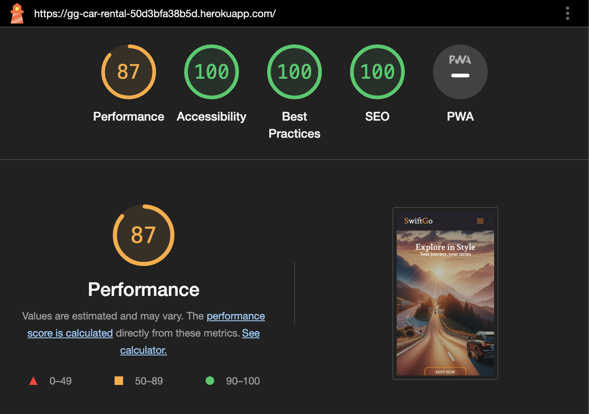
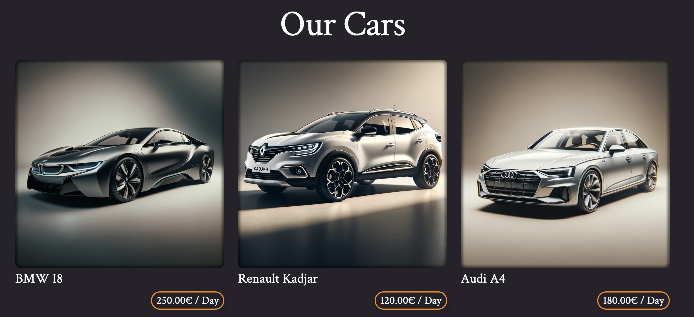
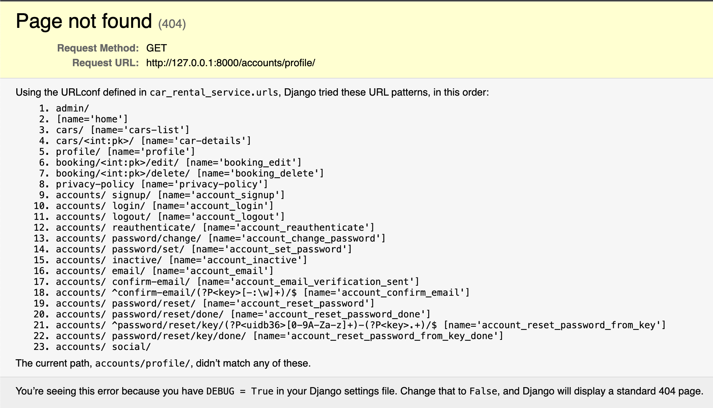
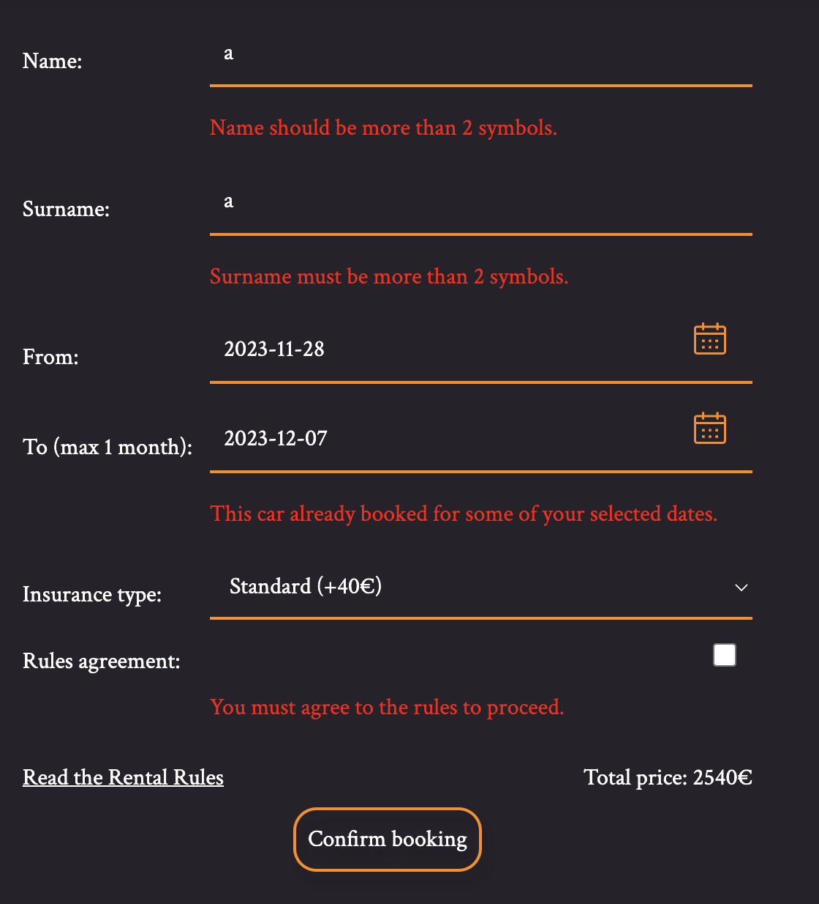

# Testing

Return back to the [README.md](README.md) file.

## Code Validation

### HTML

I have used the [HTML W3C Validator](https://validator.w3.org) to validate all of my HTML files.

| Page                   | W3C URL                                                                                                                                               | Screenshot                                                                   | Notes           |
|------------------------|-------------------------------------------------------------------------------------------------------------------------------------------------------|------------------------------------------------------------------------------|-----------------|
| Home                   | [W3C](https://validator.w3.org/nu/?showsource=yes&doc=https%3A%2F%2Fgg-car-rental-50d3bfa38b5d.herokuapp.com%2F)                                      |             | Pass: No Errors |
| Cars                   | [W3C](https://validator.w3.org/nu/?showsource=yes&doc=https%3A%2F%2Fgg-car-rental-50d3bfa38b5d.herokuapp.com%2Fcars)                                  |             | Pass: No Errors |
| Car Details (booking)  | [W3C](https://validator.w3.org/nu/?showsource=yes&doc=https%3A%2F%2Fgg-car-rental-50d3bfa38b5d.herokuapp.com%2Fcars%2F1)                              |      | Pass: No Errors |
| Profile                | [W3C](https://validator.w3.org/nu/?showsource=yes&doc=https%3A%2F%2Fgg-car-rental-50d3bfa38b5d.herokuapp.com%2Fprofile)                               |          | Pass: No Errors |
| Login                  | [W3C](https://validator.w3.org/nu/?showsource=yes&doc=https%3A%2F%2Fgg-car-rental-50d3bfa38b5d.herokuapp.com%2Faccounts%2Flogin%2F)                   |            | Pass: No Errors |
| Sign up                | [W3C](https://validator.w3.org/nu/?showsource=yes&doc=https%3A%2F%2Fgg-car-rental-50d3bfa38b5d.herokuapp.com%2Faccounts%2Fsignup%2F)                  |           | Pass: No Errors |
| Forgot Password        | [W3C](https://validator.w3.org/nu/?showsource=yes&doc=https%3A%2F%2Fgg-car-rental-50d3bfa38b5d.herokuapp.com%2Faccounts%2Fpassword%2Freset%2F)        |       | Pass: No Errors |
| Booking-Confirm-Delete | [W3C](https://validator.w3.org/nu/?showsource=yes&doc=https%3A%2F%2Fgg-car-rental-50d3bfa38b5d.herokuapp.com%2Fbooking%2F10%2Fdelete%2F)              |   | Pass: No Errors |
| Custom Error 404       | [W3C](https://validator.w3.org/nu/?showsource=yes&doc=https%3A%2F%2Fgg-car-rental-50d3bfa38b5d.herokuapp.com%2F404#textarea)                          |         | Pass: No Errors |
| Password-Reset-Confirm | [W3C](https://validator.w3.org/nu/?showsource=yes&doc=https%3A%2F%2Fgg-car-rental-50d3bfa38b5d.herokuapp.com%2Faccounts%2Fpassword%2Freset%2Fdone%2F) |  | Pass: No Errors |

### CSS

I have used the [CSS Jigsaw Validator](https://jigsaw.w3.org/css-validator) to validate all of my CSS files.

| File       | Jigsaw URL                                                                        | Screenshot                                                      | Notes           |
|------------|-----------------------------------------------------------------------------------|-----------------------------------------------------------------|-----------------|
| styles.css | [Jigsaw](https://jigsaw.w3.org/css-validator/validator.html.en#validate_by_input) |  | Pass: No Errors |

### JavaScript

I have used the [JShint Validator](https://jshint.com) to validate all of my JS files.

| File       | Screenshot                                                        | Notes           |
|------------|-------------------------------------------------------------------|-----------------|
| booking.js |  | Pass: No Errors |
| alerts.js  |   | Pass: No Errors |

### Explanation of Warnings in `booking.js`

The warnings displayed in the `booking.js` file are a result of the linter's analysis, which does not impact the functionality of the Vanilla JS Datepicker used in the project. The Datepicker is externally linked and loaded prior to the script, ensuring its functionalities are available within the `booking.js`. These warnings are indicative of the linter's limited scope of external scripts and do not represent issues that would affect the execution or output of the code.

The file `booking.js` is configured to leverage the Datepicker's features effectively, and during runtime, the Datepicker operates as expected. The mentioned warnings are simply a static analysis tool's way of flagging potential concerns, which, in this case, are already accounted for by the current setup of the script and HTML document structure.

As a part of the project's coding practice, all functionalities are thoroughly tested, and the Datepicker's integration has been validated to work seamlessly within the application's context, without any adverse effects on the user experience or data processing.

### Python

I have used the [PEP8 CI Python Linter](https://pep8ci.herokuapp.com) to validate all of my Python files.

| File      | CI URL                                  | Screenshot                                                              | Notes           |
|-----------|-----------------------------------------|-------------------------------------------------------------------------|-----------------|
| forms.py  | [PEP8 CI](https://pep8ci.herokuapp.com) |   | Pass: No Errors |
| models.py | [PEP8 CI](https://pep8ci.herokuapp.com) |  | Pass: No Errors |
| utils.py  | [PEP8 CI](https://pep8ci.herokuapp.com) |   | Pass: No Errors |
| views.py  | [PEP8 CI](https://pep8ci.herokuapp.com) |   | Pass: No Errors |

## Browser Compatibility

I've tested my deployed project on multiple browsers and multiple os to check for compatibility issues. Found several bugs like on the screenshot under:

and I fixed all bugs that I've found:

## Responsiveness

I've tested my deployed project on multiple devices to check for responsiveness issues.

## Lighthouse Audit

I've tested my deployed project using the Lighthouse Audit tool to check for any major issues.

| Page                  | Size    | Screenshot                                                                                    | Notes                                                          |
|-----------------------|---------|-----------------------------------------------------------------------------------------------|----------------------------------------------------------------|
| Home                  | Desktop |             | No warnings                                                    |
| Home                  | Mobile  |              | Minor performance warnings                                     |
| Cars                  | Desktop |             | No warnings                                                    |
| Cars                  | Mobile  |              | Minor performance warnings                                     |
| Car Details (Booking) | Desktop |  | No warnings                                                    |
| Car Details (Booking) | Mobile  |   | Minor performance warnings                                     |
| Profile               | Desktop |          | No warnings                                                    |
| Profile               | Mobile  |           | No warnings                                                    |
| Delete Booking        | Desktop |   | No warnings                                                    |
| Delete Booking        | Mobile  |    | No warnings                                                    |
| Sign In               | Desktop |          | No warnings                                                    |
| Sign In               | Mobile  |           | Minor performance warnings                                     |
| Sign Up               | Desktop |          | No warnings                                                    |
| Sign Up               | Mobile  |           | Minor performance warnings                                     |
| Sign out              | Desktop |         | No warnings                                                    |
| Sign out              | Mobile  |          | Minor accessibility warnings about contrast of Sign out button |
| Privacy policy        | Desktop |          | No warnings                                                    |
| Privacy policy        | Mobile  |           | No warnings                                                    |

## Defensive Programming

Defensive programming was manually tested with the below user acceptance testing:

| Page                              | User Action                                                | Expected Result                                                              | Pass/Fail | Comments |
|-----------------------------------|------------------------------------------------------------|------------------------------------------------------------------------------|-----------|----------|
| Nav links                         |                                                            |                                                                              |           |          |
|                                   | Click on Logo                                              | Redirection to Home page                                                     | Pass      |          |
|                                   | Click on Home link in navbar                               | Redirection to Home page                                                     | Pass      |          |
|                                   | Click on Car link in navbar                                | Redirection to Our Cars page                                                 | Pass      |          |
|                                   | Click on Profile link in navbar                            | Redirection to Profile page                                                  | Pass      |          |
|                                   | Click on Sign in link in navbar                            | Redirection to Login page                                                    | Pass      |          |
|                                   | Click on Log out link in navbar                            | Redirection to Logout confirm page                                           | Pass      |          |
| Home Page                         |                                                            |                                                                              |           |          |
|                                   | Click on Rent now button on hero section                   | Redirection to Cars List page                                                | Pass      |          |
|                                   | Click on Read more button on Rental Rules section          | Opens popup with rules                                                       | Pass      |          |
|                                   | Click on Okay in Rental Rules popup                        | Closes popup with rules                                                      | Pass      |          |
| Our Cars page                     |                                                            |                                                                              |           |          |
|                                   | Click on price button for each car                         | Redirect to Car Details and Reservations page                                | Pass      |          |
|                                   | Click on Pagination nav number                             | Redirection to that pagination page                                          | Pass      |          |
| Log In                            |                                                            |                                                                              |           |          |
|                                   | Enter valid password                                       | Field will only accept password format                                       | Pass      |          |
|                                   | Click Login button                                         | Redirects user to home page                                                  | Pass      |          |
|                                   | Click Forgot password button                               | Redirects to page with message about email with pass reset link              | Pass      |          |
| Register                          |                                                            |                                                                              |           |          |
|                                   | Enter valid email address                                  | Field will only accept email address format                                  | Pass      |          |
|                                   | Enter valid password (twice)                               | Field will only accept password format                                       | Pass      |          |
|                                   | Click on Sign In button                                    | Redirects user to blank Login page                                           | Pass      |          |
|                                   | Click on Sign Up button                                    | Redirects user to page with message about email confirmation and sends email | Pass      |          |
| Forgot password                   |                                                            |                                                                              |           |          |
|                                   | Enter new valid password (twice)                           | Field will only accept password format                                       | Pass      |          |
|                                   | Click on Change Password button                            | Redirects user to Log In page and displays message that password changed     | Pass      |          |
| Log Out                           |                                                            |                                                                              |           |          |
|                                   | Click Logout button                                        | Logs out user, Redirects user to logout page                                 | Pass      |
| Profile                           |                                                            |                                                                              |           |          |
|                                   | Click on the Edit Booking button                           | Redirects to Edit Booking page                                               | Pass      |          |
|                                   | Click on the Delete Booking button                         | Redirects to Delete Booking Confirmation page                                | Pass      |          |
| Car Reservation page              |                                                            |                                                                              |           |          |
|                                   | Fill form with valid data and click Confirm button         | Redirect to Profile page and notify that booking created                     | Pass      |          |
|                                   | Fill form with invalid data and click Confirm button       | Shows error message and fields errors messages                               | Pass      |          |
| Edit booking page                 |                                                            |                                                                              |           |          |
|                                   | Change form with valid data and click Save Changes button  | Redirect to Profile page and notify that booking edited                      | Pass      |          |
|                                   | Fill form with invalid data and click Confirm button       | Shows error message and fields errors messages                               | Pass      |          |
|                                   | Attempt to access the Edit page after booking is completed | Redirect to Profile page and notify that booking is expired                  | Pass      |          |
|                                   | Attempt to access the Edit page while logged out           | Redirect to Log In page                                                      | Pass      |          |
|                                   | Attempt to access the Edit page with another User account  | Redirect to Profile page                                                     | Pass      |          |
| Delete booking confirm page       |                                                            |                                                                              |           |          |
|                                   | Click on No I don't button                                 | Redirect back to Profile page                                                | Pass      |          |
|                                   | Click on Confirm button                                    | Deletes a booking, display alert, redirect to Profile page                   | Pass      |          |

## User Story Testing

| User Story                                                                                                                                               | Screenshot                                                              |
|----------------------------------------------------------------------------------------------------------------------------------------------------------|-------------------------------------------------------------------------|
| As a user, I can view the site so that I can learn about the SwiftGo Car Renting Service.                                                                |                  |
| As a user, I can register an account so that I can access personalized features such as booking history and profile customization.                       |                      |
| As a user, I can view available cars so that I can choose the most suitable one for my needs.                                                            |                |
| As a user, I can view a paginated list of available cars so that I don't have to scroll through a long page if there are many cars available.            |               |
| As a user, I can book a car so that I can plan my rental in advance and ensure availability.                                                             |                      |
| As a user, I can edit my booking so that I can make changes to my reservation without starting over.                                                     |           |
| As a user, I can cancel my booking so that I can opt-out if my plans change.                                                                             |           |
| As a user, I can recover my password so that I can regain access to my account if I forget my password.                                                  |               |
| As a user, I can see the rules for renting in a popup so that I can understand the terms before proceeding.                                              |            |
| As a user, I can see a dynamic price update as I modify the booking form, ensuring that I am always aware of the cost.                                   |          |
| As a user, when choosing dates, I am prevented from selecting an end date before the start date, which helps to avoid errors.                            |       |
| As a user, I am restricted to book no more than one month ahead, in compliance with the rental rules.                                                    |  |
| As a user, I would like to receive feedback on my actions through alert messages, so that I can understand the outcome of my interactions with the site. |                         |
| As an administrator, I can manage car listings so that I can keep the inventory up to date.                                                              |                 |
| As an administrator, I can manage user bookings so that I can assist users with their reservations.                                                      |                |

## Automated Testing

### Python (Unit Testing)

I have used Django's built-in unit testing framework to test the application functionality.

In order to run the tests, I ran the following command in the terminal each time:

`python3 manage.py test`

To create the coverage report, I would then run the following commands:

`coverage run --source=name-of-app manage.py test`

`coverage report`

To see the HTML version of the reports, and find out whether some pieces of code were missing, I ran the following commands:

`coverage html`

`python3 -m http.server`

Below are the results from the various apps on my application that I've tested:

| App                | Coverage | Screenshot                                                                      |
|--------------------|----------|---------------------------------------------------------------------------------|
| Car rental service | 87%      |  |

## Bugs

- Unable to navigate to the 'Sign In' page using the Allauth library.

  

  - Initial Issue: Clicking the 'Sign In' link did not navigate anywhere and did not show any error messages.
  - Diagnosis and Fix: After removing `LOGIN_REDIRECT_URL = '/'`, an error indicating 'template accounts/profile not found' was revealed. This led to the realization that the issue was due to already being logged in via the Django admin panel. Logging out from the admin panel resolved the issue and allowed normal function of the 'Sign In' link.

- Form in `CarDetailsView` did not display validation errors as expected.

  

  - Initial Issue: The form in the `CarDetailsView`, which extends both `DetailView` and `FormMixin`, was not showing validation errors defined in the view.
  - Diagnosis and Fix: Discovered that the combination of `DetailView` and `FormMixin` was preventing the standard form error handling process. The issue was resolved by explicitly defining the `form_invalid()` method in `CarDetailsView`, enabling it to properly handle and display form validation errors.

- In the 'Edit Booking' form, date fields became empty after submitting dates that overlapped with existing bookings.

  

  - Initial Issue: When a user attempted to edit a booking and entered dates that overlapped with another user's booking, the form returned an error, but the date fields were reset to empty, losing the user's input.
  - Diagnosis and Fix: Realized that the issue was related to the date format inconsistency across the project. Resolved the problem by standardizing the date format throughout the application, ensuring that the date fields retained the user's input even when an error was returned.

- Errors occurred when trying to edit or delete a booking that had already been completed.

  

  - Initial Issue: Users encountered an error when attempting to access the edit or delete page for a booking that had already expired. The error manifested when users directly entered the booking ID in the URL.
  - Diagnosis and Fix: Implemented a `dispatch` method in the booking edit and delete views to check if a booking was already completed. If a booking had expired, the user is redirected to the profile page with an alert message "This booking has already expired and cannot be edited." Additionally, if the user is not authenticated, they are redirected to the login page. This approach prevented unauthorized access to completed bookings and enhanced the application's security and user experience.
**Open Issues**

Any open issues can be tracked [here](https://github.com/GenaPlem/django_car_rental/milestone/1). These are the "Won't Have's" for this project that, for a variety of reasons, will not be included in this projct submission. These may be revisited and added in the future.

## Unfixed Bugs

There are no remaining bugs that I am aware of.